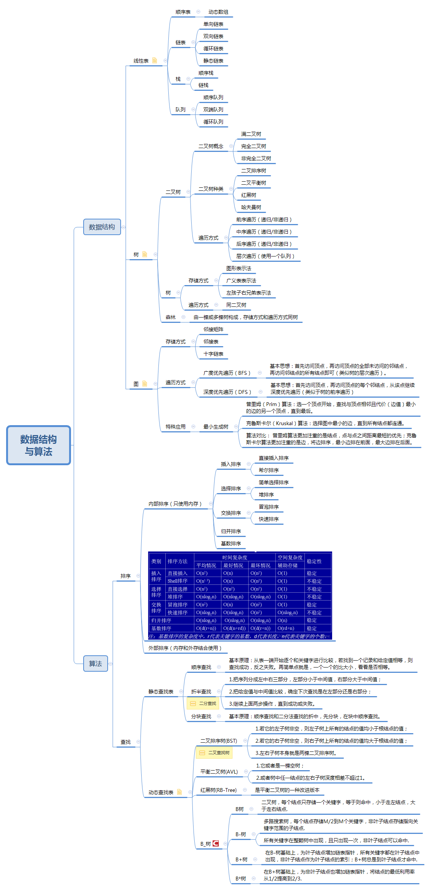

# 数据结构与算法
## 数据结构概述
1. 数据结构定义
```
数据结构：是相互之间存在一种或多种特定关系的数据元素的集合。
```
2. 数据结构分类
  * 逻辑结构  
集合结构、线性结构、树形结构、图形结构  
  * 物理结构  
顺序存储结构、链式存储结构  
3. 抽象数据类型
```
抽象数据类型是指一个数据模型及定义在该模型上的一组操作。
```
## 算法
1. 算法定义
```
算法是解决特定问题求解步骤的描述，在计算机中为指令的有限序列，并且每条指令表示一个或多个操作。
```
2. 算法特征  
有穷性、确定性、可行性、输入、输出
3. 算法的设计要求  
正确性、可读性、健壮性、高效率和低存储量要求
## 线性表
1. 定义
```
线性表(List)：零个或多个数据元素的有限序列。
```
2. 顺序存储结构
```
线性表的顺序存储结构，指的是用一段地址连续的存储单元依次存储线性表的数据元素。
```
3. 链式存储结构  
单链表、静态链表、循环链表、双向链表。
## 栈
1. 定义
```
栈是限定仅在表尾进行插入和删除操作的线性表。
```
2. 顺序栈  
两栈共享空间  
3. 链栈  
4. 栈的应用  
递归、四则运算（后缀表示法、中缀表示法）  
## 队列
1. 定义
```
队列是只允许在一段进行插入操作，而在另一端进行删除操作的线性表。
```
2. 顺序存储队列  
3. 循环队列  
4. 链式存储队列  
## 串
1. 定义
```
串是由零个或多个字符组成的有限序列，又名叫字符串。
```
2. 存储结构  
顺序存储结构、链式存储结构
3. 匹配算法  
朴素的模式匹配算法、KMP模式匹配算法
## 树
1. 定义
```
树是n（n>=0）个结点的有限集。n=0时称为空树。在任意一棵非空树中：（1）有且仅有一个特定的称为根的结点；（2）当n>1时，其余结点可分为m（m>0）个互不相交的有限集T1、T2、。。。、Tm，其中每一个集合本身又是一棵树，并且称为根的子树。
```
2. 树的存储结构  
双亲表示法、孩子表示法、孩子兄弟表示法
3. 二叉树
  * 定义
```
二叉树是n（n>=0）个结点的有限集合，该集合或者为空集（称为空二叉树），或者由一个根结点和两个互不相交的、分别称为根结点的左子树和右子树的二叉树组成。
```
  * 特殊二叉树  
      斜树、满二叉树、完全二叉树
  * 二叉树性质  
  * 二叉树存储结构  
      顺序存储结构、二叉链表
  * 二叉树遍历  
      前序遍历、中序遍历、后序遍历、层序遍历
  * 线索二叉树
  * 树、森林与二叉树的转换
    树转换为二叉树  
    森林转换为二叉树  
    二叉树转换为树  
    二叉树转换为森林
  * 赫夫曼树
## 图
1. 图的术语
  * 图按照有无方向分为无向图和有向图。
  * 图按照边或弧的多少分稀疏图和稠密图。如果任意两个顶点之间都存在边叫完全图，有向的叫有向完全图。若无重复的边或顶点到自身的边则叫简单图。
  * 图中顶点之间有邻接点、依附的概念。无向图顶点的边数叫做度，有向图顶点分为入度和出度。
  * 图上的边或弧上带权则称为网。
  * 图中顶点间存在路径，两顶点存在路径则说明是连通的，如果路径最终回到起始点则称为环，当中不重复叫简单路径。若任意两顶点都是连通的，则图就是连通图，有向则称强连通图。图中有子图，若子图极大连通则就是连通分量，有向的则称强连通分量。
  * 无向图中连通且n个顶点n-1条边叫生成树。有向图中一顶点入度为0其余顶点入度为1的叫有向树。一个有向图由若干课有向树构成生成森林。
2. 图的存储结构
  * 邻接矩阵
  * 邻接表
  * 十字链表
  * 邻接多重表
  * 边集数组
3. 图的遍历
  * 深度优先遍历
  * 广度优先遍历
4. 最小生成树
  * 普里姆（Prim）算法
  * 克鲁斯卡尔（Kruskal）算法
  * 博客：https://blog.csdn.net/luoshixian099/article/details/51908175
5. 最短路径
  * 迪杰斯特拉（Dijkstra）算法
  * 博客：https://www.jianshu.com/p/ff6db00ad866
  * 弗洛伊德（Floyd）算法
  * 博客：https://blog.csdn.net/weixin_38361153/article/details/88415181
6. 拓扑排序
  * 博客：https://blog.csdn.net/yeiweilan/article/details/87878140
7. 关键路径
## 查找
1. 顺序表查找
2. 有序表查找
  * 折半查找
  * 插值查找
  * 斐波那契查找
  * 博客：https://blog.csdn.net/jinyan1111/article/details/79916455
3. 线性索引查找
  * 稠密索引
  * 分块索引
  * 倒排索引
4. 二叉排序树
5. 平衡二叉树（AVL树）
  * 红黑树
  * 博客：https://www.jianshu.com/p/e136ec79235c
6. 多路查找树（B树）
  * 2-3树
  * 2-3-4树
  * B树
  * 博客：https://www.jianshu.com/p/a858bb15cbf0
  ```
  B树是一种平衡的多路查找树
  ```
  * B+树
  * 博客：https://blog.csdn.net/qq_26222859/article/details/80631121

7. 散列表查找（哈希表）
  * 直接定址法
  * 数字分析法
  * 平方取中法
  * 折叠法
  * 除留余数法
  * 随机数法
8. 处理散列冲突方法
  * 开放定址法：线性探测法、二次探测法、随机探测法
  * 再散列函数法
  * 链地址法
  * 公共溢出区法
## 排序
1. 冒泡排序
2. 简单选择排序
  * 博客：https://www.jianshu.com/p/3194c9b47e91
3. 直接插入排序
  * 博客：https://www.jianshu.com/p/7cf0656e76dd
4. 希尔排序
  * 博客：https://www.jianshu.com/p/40dcc3b83ddc
5. 堆排序
  * 博客：https://www.jianshu.com/p/0d383d294a80
6. 归并排序
  * 博客：https://blog.csdn.net/qq_40907279/article/details/81607634
7. 快速排序
  * 博客：http://www.sohu.com/a/246785807_684445
  * https://www.cnblogs.com/nullzx/p/5880191.html
## 数据结构框架图
