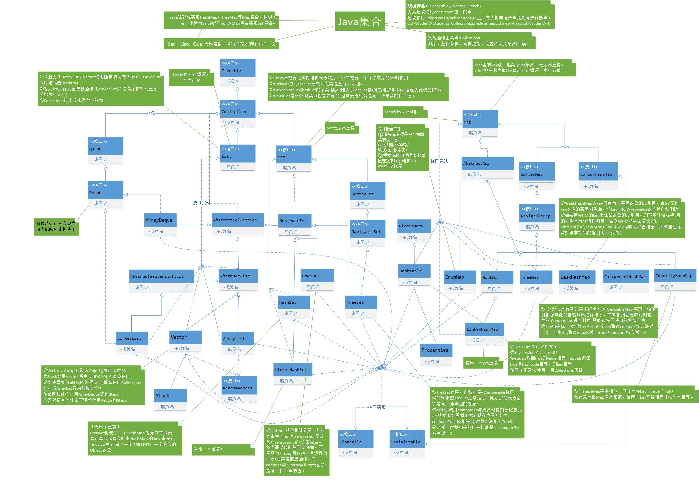

# Java集合框架
## 框架总体架构图

## 博客
1. https://blog.csdn.net/feiyanaffection/article/details/81394745
2. https://www.cnblogs.com/chenglc/p/8073049.html
## Collection
### List
1. LinkedList
  - 双向链表
  - https://blog.csdn.net/qedgbmwyz/article/details/80108618
2. ArrayList
  - 默认的初始化长度是10，底层是通过数组对象实现。扩容1.5倍。
  - https://blog.csdn.net/sihai12345/article/details/79382649
3. Vector
  - https://blog.csdn.net/qq_38293564/article/details/80665281
  - http://baijiahao.baidu.com/s?id=1638844080997170869&wfr=spider&for=pc
4. Stack
	- https://www.jianshu.com/p/01192de8c21a
### Set
1. HashSet
  - https://blog.csdn.net/NGUhuang/article/details/80562104
2. LinkedHashSet
	- https://www.cnblogs.com/tong-yuan/p/LinkedHashSet.html
3. TreeSet
  - https://blog.csdn.net/qq_36441169/article/details/80835438
  - https://www.cnblogs.com/skywang12345/p/3311268.html
## Map
1. HashTable(废弃)
2. HashMap
  - 链地址法解决哈希冲突，键值都允许null值。链表长度到8时转换为红黑树。初始化容量16，2倍扩容。默认负载因子0.75
  - https://www.cnblogs.com/winterfells/p/8876888.html
  - https://segmentfault.com/a/1190000015213253
  - https://www.jianshu.com/p/4aa3bb16f36c
  - https://blog.csdn.net/u010386612/article/details/80302777
3. LinkedHashMap
  - https://segmentfault.com/a/1190000012964859
4. WeakHashMap
5. ConcurrentHashMap
  - cnblogs.com/zerotomax/p/8687425.html
6. TreeMap
  - https://www.cnblogs.com/qlky/p/7361877.html
  - https://www.cnblogs.com/warehouse/p/9346757.html
  - https://www.jianshu.com/p/07cceede7b03
7. IdentityHashMap
## Collections
## Arrays
## 其他
### fail-fast机制
  - https://blog.csdn.net/zymx14/article/details/78394464
  - https://juejin.im/post/5b7cc7ce51882542b45dd220
### Comparable和Comparator
  - https://www.cnblogs.com/skywang12345/p/3324788.html
### poll()方法和remove()方法区别？
  - poll() 和 remove() 都是从队列中取出一个元素，但是 poll() 在获取元素失败的时候会返回空，但是 remove() 失败的时候会抛出异常。
### Arrays.deepToString()与Arrays.toString()的区别
  - Arrays.deepToString()主要用于数组中还有数组的情况，而Arrays.toString()则相反，对于Arrays.toString()而言，当数组中有数组时，不会打印出数组中的内容，只会以地址的形式打印出来。
### Collections.sort()和Arrays.sort()排序算法选择
  - https://blog.csdn.net/TimHeath/article/details/68930482